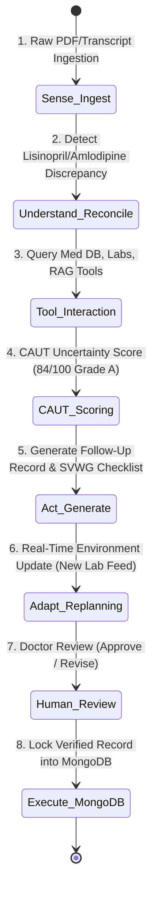

# MediAssistant — AI Systems That Act, Adapt, and Execute 🚀

> **Agentic AI Hackathon Submission**
> **Theme**: Build AI Systems That Act, Adapt, and Execute — Going beyond simple Q&A text generation to drive autonomous multi-step decision making, tool interaction, real-time adaptation, and governed execution.

---

## 🎯 The Core Problem: Beyond Static LLM Responses

Most healthcare AI applications stop at generating static text answers. When patient data is fragmented across consultation transcripts, discharge summaries, laboratory reports, and EHR pharmacy databases, static models produce incomplete or unverified summaries.

**MediAssistant doesn't stop at generating text.** It is an autonomous agentic platform that actively pursues a clinical goal through:
1. **Perceive & Ingest**: Triangulates multi-source electronic health records into a mutable **Clinical Truth Graph**.
2. **Act & Intersect**: Executes multi-step tool calls (Patient DB, Medication/Allergy Lookup, Lab Retrieval, Clinical Guideline RAG, Safety Validation).
3. **Adapt in Real Time**: Detects environment changes (new lab arrivals, updated pharmacy feeds), invalidates stale graph nodes, re-scores uncertainty via the **CAUT Engine**, and re-plans the follow-up record.
4. **Govern & Execute**: Enforces mandatory **Human-in-the-Loop Doctor Review** before locking records into **MongoDB**.

---

## ⚡ The Sense → Understand → Act → Adapt Loop



---

## 🏆 Key Features & Innovation Modules

| Component / Module | Innovation & Agentic Power | Implementation |
| :--- | :--- | :--- |
| **CAUT Engine** | Quantifies Uncertainty & Triangulation (84/100 Grade A Confidence) | [CautPanel.jsx](file:///c:/Users/WELCOME/MedicAssist/frontend/src/components/CautPanel.jsx) |
| **PGV Engine** | Provenance Graph Visualization mapping terms back to raw PDF sources | [ProvenanceMap.jsx](file:///c:/Users/WELCOME/MedicAssist/frontend/src/components/ProvenanceMap.jsx) |
| **SVWG Engine** | Structured Verification Checklist & Safety Guardrails | [VerificationChecklist.jsx](file:///c:/Users/WELCOME/MedicAssist/frontend/src/components/VerificationChecklist.jsx) |
| **Live Groq LLM** | Powers real-time interactive AI Co-Pilot drawer with Llama-3.3-70B | [AICopilotPanel.jsx](file:///c:/Users/WELCOME/MedicAssist/frontend/src/components/AICopilotPanel.jsx) |
| **MongoDB Manager** | Persists synthetic patient documents in `medicassist_db` | [app/mongodb.py](file:///c:/Users/WELCOME/MedicAssist/backend/app/mongodb.py) |
| **Patient Photo Portal** | Uploads recent patient photos with real-time `FileReader` preview | [AddPatientModal.jsx](file:///c:/Users/WELCOME/MedicAssist/frontend/src/components/AddPatientModal.jsx) |
| **Security & HIPAA** | Enforces `synthetic_only: true` & `human_review_required: true` | [SecurityModal.jsx](file:///c:/Users/WELCOME/MedicAssist/frontend/src/components/SecurityModal.jsx) |

---

## 🔬 How MediAssistant Demonstrates "Act, Adapt, and Execute"

### 1. **ACT (Multi-Step Tool Interaction)**
- When initialized, the Orchestrator doesn't just ask an LLM once. It sequentially calls `PatientDBTool` -> `MedicationLookupTool` -> `LabRetrieverTool` -> `ClinicalGuidelineRAGTool` -> `SafetyValidatorTool` to build a complete clinical truth graph.

### 2. **ADAPT (Real-Time Environment Re-Planning)**
- Clicking **`[ Simulate New Data ]`** triggers a live environment change notification. The agent invalidates stale observation nodes, marks previous pharmacy data as STALE, re-queries tools, updates the CAUT score, and regenerates affected sections of the follow-up record dynamically.

### 3. **EXECUTE (Governed Human-in-the-Loop Execution)**
- Enforces strict safety guardrails (`human_review_required: true`). The doctor evaluates the draft follow-up record and clicks `[ Approve Draft Record ]` or `[ Request AI Revision ]` to lock the record into MongoDB.

---

## 🛠️ Tech Stack & Integration

- **Frontend**: React, Vite, Vanilla CSS Design System, Lucide Icons, React Router.
- **Backend**: FastAPI (Python), PyMongo, Uvicorn, WebSockets for real-time trace streaming.
- **AI Models & API**: Groq API (`llama-3.3-70b-versatile`) with configurable API key.
- **Database**: MongoDB (`medicassist_db`), fallback in-memory JSON.

---

## 🏃 Quick Start Guide

1. **Start Backend Server**:
   ```bash
   cd c:\Users\WELCOME\MedicAssist\backend
   python -m uvicorn app.main:app --port 8000 --reload
   ```

2. **Start Frontend Workspace**:
   ```bash
   cd c:\Users\WELCOME\MedicAssist\frontend
   npm run dev
   ```

3. Open `http://localhost:5173` -> Click **`[ Evaluator Demo Passway ]`** to experience the agent in action!
